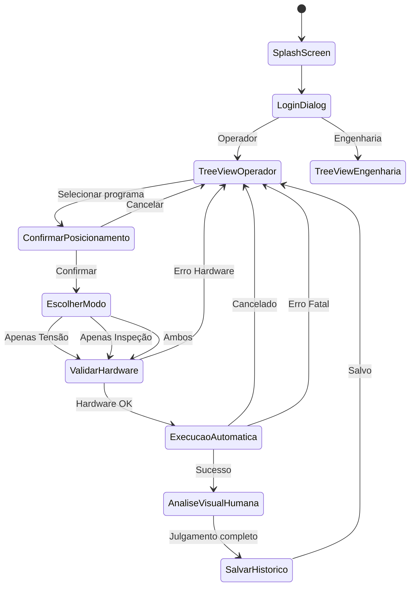

# Fluxo do Usuário Operador - Tensiômetro

**Data:** 2026-01-08
**Versão:** 2.0 (Fluxo Simplificado)
**Status:** ✅ Atualizado
**Baseado em:** `docs/guides/fluxo_usuario_questionario.md`

**Mudanças na v2.0:**
- ✅ Adotada abordagem "descartar e recomeçar" (aprovada pelo cliente)
- ✅ Atualizado fluxo de decisão com 3 status finais (A-AUTO, A-USER, REPROV)
- ✅ Removido loop iterativo de correção e reteste
- ✅ Adicionado dialog final: Descartar / Reprovar
- ✅ Histórico limpo (sem informações de iteração)
- ✅ Inspeções descartadas NÃO ficam no histórico (apenas log de auditoria)

**Veja também:**
- `docs/guides/ANALISE_PROPOSTA_SIMPLIFICADA.md` - Análise comparativa completa
- `docs/wireframes/svg/06_analise_visual_humana_v2.svg` - Tela de análise atualizada
- `docs/wireframes/svg/07_tela_historico_v2.svg` - Tela de histórico atualizada

---

## 📋 ÍNDICE

1. [Visão Geral](#visão-geral)
2. [Arquitetura de Perfis](#arquitetura-de-perfis)
3. [Fluxo Principal Completo](#fluxo-principal-completo)
4. [Wireframes Conceituais](#wireframes-conceituais)
5. [Árvore de Decisão](#árvore-de-decisão)
6. [Especificações de Componentes UI](#especificações-de-componentes-ui)
7. [Estados da Interface](#estados-da-interface)
8. [Fluxos Alternativos](#fluxos-alternativos)
9. [Integração com Hardware](#integração-com-hardware)
10. [Matriz de Permissões](#matriz-de-permissões)

---

## VISÃO GERAL

### Objetivo do Documento
Este documento define o fluxo completo do usuário **operador** do sistema Tensiômetro, incluindo wireframes conceituais e árvores de decisão para guiar a implementação da interface final.

### Persona: Operador
- **Função:** Executar medições de tensão e inspeção visual de stencils
- **Treinamento:** Operador treinado no sistema e processo
- **Privilégios:** Executar programas pré-configurados (sem editar parâmetros)
- **Responsabilidade:** Julgar defeitos e aprovar/reprovar stencils

### Persona: Engenharia
- **Função:** Configurar programas, definir critérios, cadastrar tipos de defeitos
- **Privilégios:** Acesso completo a configurações
- **Responsabilidade:** Manter base de programas e parâmetros de qualidade

---

## ARQUITETURA DE PERFIS

### Sistema de Login

```
┌─────────────────────────────────────────┐
│         TENSIO METRO - LOGIN            │
├─────────────────────────────────────────┤
│                                         │
│  [Logo Empresa]                         │
│                                         │
│  ┌───────────────────────────────────┐ │
│  │ Usuário: [________________]       │ │
│  │ Senha:   [________________]       │ │
│  └───────────────────────────────────┘ │
│                                         │
│  [Entrar]              [Cancelar]      │
│                                         │
└─────────────────────────────────────────┘
```

### Controle de Acesso

| Funcionalidade | Operador | Engenharia |
|----------------|----------|------------|
| Executar programas | ✅ | ✅ |
| Criar programas | ❌ | ✅ |
| Editar parâmetros de programa | ❌ | ✅ |
| Definir critérios de aprovação | ❌ | ✅ |
| Cadastrar tipos de defeitos | ❌ | ✅ |
| Julgar defeitos na medição | ✅ | ✅ |
| Ver histórico | ✅ | ✅ |
| Gerar relatórios | ✅ | ✅ |
| Exportar dados | ✅ | ✅ |
| Ajustar configurações do sistema | ❌ | ✅ |

---

## FLUXO PRINCIPAL COMPLETO

### Diagrama de Estado do Operador



### Fluxo Detalhado

```
1. INÍCIO
   ├─ Splash screen (2-3 segundos)
   └─ Login dialog

2. AUTENTICAÇÃO
   ├─ Usuário insere credenciais
   ├─ Sistema valida perfil
   └─ Exibe tela apropriada

3. TELA INICIAL (TreeView)
   ├─ Lista de programas cadastrados
   ├─ Campo de busca incremental
   ├─ Leitor de código de barras ativo
   └─ Painel de detalhes do stencil selecionado

4. SELEÇÃO DE PROGRAMA
   ├─ Usuário clica na TreeView OU
   ├─ Usuário escaneia código de barras
   └─ Sistema exibe detalhes do programa

5. CONFIRMAÇÃO DE POSICIONAMENTO
   ├─ Dialog: "Confirme que o stencil está posicionado"
   ├─ Botões: [Confirmar] [Cancelar]
   └─ Emergency stop monitorado

6. ESCOLHA DO MODO
   ├─ Dialog: "Selecione o modo de inspeção"
   ├─ Opções: Apenas Tensão, Apenas Inspeção, Ambos
   └─ Engenharia pode forçar modo específico

7. VALIDAÇÃO DE HARDWARE
   ├─ Verifica PLC conectado
   ├─ Verifica Tensiômetro conectado
   ├─ Verifica Câmera conectada
   └─ Se erro: bloqueia execução + mensagem

8. EXECUÇÃO AUTOMÁTICA
   ├─ Barra de progresso
   ├─ Contador: "Medindo ponto 3/25"
   ├─ Tempo estimado restante
   ├─ Valores em tempo real
   └─ Botão: [Parar] (descarta dados)

9. ANÁLISE VISUAL HUMANA
   ├─ Lista de defeitos identificados
   ├─ Percorrer cada defeito
   ├─ Ver imagem do defeito
   ├─ Selecionar classificação (dropdown)
   ├─ Decidir: [Confirmar Defeito] [Aprovar]
   └─ Repetir até todos defeitos julgados

10. SALVAMENTO AUTOMÁTICO
    ├─ Salvar no histórico
    ├─ Enviar para API (se habilitado)
    └─ Retornar para TreeView
```

---

## WIREFRAMES CONCEITUAIS

### 1. Tela Inicial - TreeView de Programas

```
┌─────────────────────────────────────────────────────────────────────────────┐
│ TENSIO METRO                                    Operador: João Silva       │
├─────────────────────────────────────────────────────────────────────────────┤
│                                                                             │
│  ┌─────────────────────────────────┐  ┌──────────────────────────────────┐ │
│  │ Busca: [___________________] 🔍  │  │ Detalhes do Stencil             │ │
│  │                                 │  │                                  │ │
│  │ Filtros: [▼ Últimas 10]         │  │ Código: STENCIL-ABC-123         │ │
│  │         [▼ Todos os status]     │  │ Modelo: 500x500mm               │ │
│  │                                 │  │ Fabricante: XYZ Stencils        │ │
│  │ [Ordenar por: ▼ Nome]           │  │                                  │ │
│  └─────────────────────────────────┘  │ Última medição:                 │ │
│                                        │  Data: 15/12/2025 14:30        │ │
│  ┌─────────────────────────────────┐  │  Status: ✅ APROVADO             │ │
│  │ Programas Cadastrados           │  │  Operador: Maria Santos         │ │
│  ├─────────────────────────────────┤  │                                  │ │
│  │ 📁 STENCIL-ABC-123              │  │ Histórico (10 medições)         │ │
│  │ 📁 STENCIL-XYZ-456              │  │  ✅✅✅✅❌✅✅✅✅❌✅             │ │
│  │ 📁 STENCIL-DEF-789              │  │                                  │ │
│  │ 📁 STENCIL-GHI-012              │  │ [Ver Histórico Completo]        │ │
│  │                                 │  │ [Inspecionar Stencil] →        │ │
│  └─────────────────────────────────┘  └──────────────────────────────────┘ │
│                                                                             │
│  [Escanear Código de Barras] 📷                                             │
│                                                                             │
│  Status: PLC ✅ | Tensiômetro ✅ | Câmera ✅                               │
└─────────────────────────────────────────────────────────────────────────────┘
```

### 2. Dialog de Confirmação de Posicionamento

```
┌─────────────────────────────────────────────────────────┐
│         Confirmação de Posicionamento                   │
├─────────────────────────────────────────────────────────┤
│                                                         │
│  ┌───────────────────────────────────────────────────┐  │
│  │                                                   │  │
│  │   [Ícone: Stencil posicionado na máquina]        │  │
│  │                                                   │  │
│  │   Confirme que o stencil STENCIL-ABC-123         │  │
│  │   está corretamente posicionado na máquina.      │  │
│  │                                                   │  │
│  │   Verifique:                                      │  │
│  │   • O código do stencil corresponde              │  │
│  │   • O stencil está fixado corretamente           │  │
│  │   • A área de medição está acessível             │  │
│  │                                                   │  │
│  └───────────────────────────────────────────────────┘  │
│                                                         │
│           [Cancelar]      [Confirmar Posicionamento]    │
│                                                         │
└─────────────────────────────────────────────────────────┘
```

### 3. Dialog de Escolha do Modo

```
┌─────────────────────────────────────────────────────────┐
│           Selecionar Modo de Inspeção                   │
├─────────────────────────────────────────────────────────┤
│                                                         │
│  Selecione o modo de inspeção para STENCIL-ABC-123:    │
│                                                         │
│  ┌─────────────────────────────────────────────────┐    │
│  │  ⚙️  Medição de Tensão                         │    │
│  │      Medir tensão superficial em grade NxN      │    │
│  │      Duração estimada: ~3 minutos               │    │
│  │                                                 │    │
│  │         [   Selecionar   ]                      │    │
│  └─────────────────────────────────────────────────┘    │
│                                                         │
│  ┌─────────────────────────────────────────────────┐    │
│  │  🔍 Inspeção Visual                            │    │
│  │      Inspecionar aberturas do stencil           │    │
│  │      Duração estimada: ~5 minutos               │    │
│  │                                                 │    │
│  │         [   Selecionar   ]                      │    │
│  └─────────────────────────────────────────────────┘    │
│                                                         │
│  ┌─────────────────────────────────────────────────┐    │
│  │  ⚙️ + 🔍 Ambos (Completo)                       │    │
│  │      Medir tensão + Inspecionar visualmente     │    │
│  │      Duração estimada: ~8 minutos               │    │
│  │                                                 │    │
│  │         [   Selecionar   ]                      │    │
│  └─────────────────────────────────────────────────┘    │
│                                                         │
│                              [Cancelar]                 │
└─────────────────────────────────────────────────────────┘
```

### 4. Tela de Execução Automática

```
┌─────────────────────────────────────────────────────────────────────────────┐
│                    Executando Medição de Tensão                            │
├─────────────────────────────────────────────────────────────────────────────┤
│                                                                             │
│  Programa: STENCIL-ABC-123        Modo: Medição de Tensão                  │
│                                                                             │
│  ┌───────────────────────────────────────────────────────────────────────┐ │
│  │                           Progresso Geral                            │ │
│  │  ████████████████████░░░░░░░░░░░░░░░░░░░░░░░░░░░░░░░░░░░░░░░░░░░░░  │ │
│  │                           12/25 pontos (48%)                        │ │
│  └───────────────────────────────────────────────────────────────────────┘ │
│                                                                             │
│  ┌──────────────────────────┐  ┌──────────────────────────────────────────┐ │
│  │  Ponto Atual             │  │  Valores em Tempo Real                  │ │
│  │  ┌────────────────────┐  │  │                                          │ │
│  │  │  [Grid 5x5]        │  │  │  Tensão atual:                          │ │
│  │  │  █ █ █ █ █         │  │  │  ┌──────────────┐                       │ │
│  │  │  █ █ ● █ █         │  │  │  │  32.5 N/cm   │ ← animated            │ │
│  │  │  █ █ █ █ █         │  │  │  └──────────────┘                       │ │
│  │  │  █ █ █ █ █         │  │  │                                          │ │
│  │  │  █ █ █ █ █         │  │  │  Mínimo: 28.3 N/cm                      │ │
│  │  └────────────────────┘  │  │  Máximo: 35.1 N/cm                      │ │
│  │  ● = Ponto atual        │  │  Média: 31.8 N/cm                       │ │
│  └──────────────────────────┘  │                                          │
│                                 │  Status: ✅ DENTRO ESPEC                 │ │
│  ┌──────────────────────────┐  └──────────────────────────────────────────┘ │
│  │  Tempo Estimado         │                                                │
│  │  ┌────────────────────┐  │                                                │
│  │  │  ⏱️  01:23 restante│  │  Status do Hardware:                        │
│  │  └────────────────────┘  │  │  PLC: ✅ | Tensiômetro: ✅ | Câmera: ✅   │
│  └──────────────────────────┘  │                                             │
│                                 │                                             │
│                                 │  [🛑 Parar Execução]                       │
└─────────────────────────────────────────────────────────────────────────────┘
```

### 5. Tela de Análise Visual Humana

**⚠️ VERSÃO ATUALIZADA:** Veja `docs/wireframes/svg/06_analise_visual_humana_v2.svg`

```
┌─────────────────────────────────────────────────────────────────────────────┐
│                    Análise de Defeitos - Julgamento                         │
├─────────────────────────────────────────────────────────────────────────────┤
│                                                                             │
│  Programa: STENCIL-ABC-123        Modo: Inspeção Visual                    │
│                                                                             │
│  ┌─────────────────────────────────────────────────────────────────────┐   │
│  │  Defeitos Identificados: 3 de 15 analisados                         │   │
│  │  ████████████░░░░░░░░░░░░░░░░░░                                    │   │
│  └─────────────────────────────────────────────────────────────────────┘   │
│                                                                             │
│  ┌─────────────────────────────┐  ┌──────────────────────────────────────┐ │
│  │  Defeito #3 de 15            │  │  Imagem do Defeito                  │ │
│  │  ┌───────────────────────┐   │  │  ┌────────────────────────────────┐  │ │
│  │  │ Posição: X=125, Y=78  │   │  │  │                                │  │ │
│  │  │ Tipo: Abertura        │   │  │  │    [Imagem capturada           │  │ │
│  │  │ Status: ⚠️ BLOQUEADA  │   │  │  │     da abertura bloqueada]      │  │ │
│  │  │ 26% aberta (74% bloqueada) │  │  │                                │  │ │
│  │  └───────────────────────┘   │  │  │    Zoom: [+] [-] [Reset]       │  │ │
│  │                              │  │  │                                │  │ │
│  │  Anotações (opcional):       │  │  └────────────────────────────────┘  │ │
│  │  ┌─────────────────────────┐ │  │                                      │ │
│  │  │ [_____________________] │ │  │  ┌────────────────────────────────┐  │ │
│  │  │ [_____________________] │ │  │  │ Análise do Sistema:            │  │ │
│  │  └─────────────────────────┘ │  │  │                                │  │ │
│  └─────────────────────────────┘  │  │ Área esperada: 2.3 mm²        │  │ │
│                                   │  │ Área observada: 0.6 mm²       │  │ │
│  ┌─────────────────────────────┐  │  │ % Aberta: 26%                  │  │ │
│  │  Navegação                  │  │  │ ████████████░░░░░░░             │  │ │
│  │  [◀ Anterior] [Próximo ▶]  │  │  │                                │  │ │
│  └─────────────────────────────┘  │  │ ⚠️ BLOQUEADO - Fora de spec.   │  │ │
│                                   │  └────────────────────────────────┘  │ │
│  ┌─────────────────────────────┐  │                                      │ │
│  │  Classificação:              │  │  ┌────────────────────────────────┐  │ │
│  │  ┌─────────────────────────┐ │  │  │ Seu Julgamento:                │  │ │
│  │  │ Tipo de Defeito: [▼]   │ │  │  │                                │  │ │
│  │  │ • Bloqueado por resíduo │ │  │  │  Este defeito é REAL?          │  │ │
│  │  │ • Abertura deformada    │ │  │  │                                │  │ │
│  │  │ • Dano mecânico         │ │  │  └────────────────────────────────┘  │ │
│  │  │ • Sujidade generalizada │ │  │                                      │ │
│  │  │ • Outro...              │ │  │  ┌────────────────────────────────┐  │ │
│  │  └─────────────────────────┘ │  │  │ [✓ APROVAR (Falha Falsa)]     │  │ │
│  └─────────────────────────────┘  │  │                                │  │ │
│                                   │  │  [✓ CONFIRMAR como Defeito Real]│ │ │
│                                   │  │                                │  │ │
│                                   │  └────────────────────────────────┘  │ │
│                                   │                                      │ │
│                                   │  [📋 Finalizar Análise]              │ │
└─────────────────────────────────────────────────────────────────────────────┘

┌─────────────────────────────────────────────────────────────────────────────┐
│              Dialog Final: Análise Completa - Decisão Final                │
├─────────────────────────────────────────────────────────────────────────────┤
│                                                                             │
│                          15 defeitos analisados                             │
│                                                                             │
│  ✅ 12 aprovados (falhas falsas)                                           │
│  ❌ 3 confirmados como defeitos reais                                      │
│                                                                             │
│                   Há defeitos confirmados. O que deseja fazer?             │
│                                                                             │
│  ┌─────────────────────────────────────────────┐  ┌─────────────────────┐ │
│  │  🗑️ Descartar Inspeção                      │  │  ❌ Reprovar Sessão │ │
│  │                                             │  │                     │ │
│  │  Não salva no histórico                     │  │  Salva no histórico │ │
│  │  Faça correção e inspecione novamente       │  │  como Reprovado     │ │
│  └─────────────────────────────────────────────┘  └─────────────────────┘ │
│                                                                             │
│                           [Cancelar]  [Confirmar]                           │
└─────────────────────────────────────────────────────────────────────────────┘
```

**Status Finais Possíveis:**
- **A-AUTO** (Verde): Aprovado Automático - sem defeitos detectados
- **A-USER** (Verde-amarelo): Aprovado com Julgamento - defeitos julgados como falhas falsas
- **REPROV** (Vermelho): Reprovado - defeitos confirmados como reais

### 6. Tela de Histórico

**⚠️ VERSÃO ATUALIZADA:** Veja `docs/wireframes/svg/07_tela_historico_v2.svg`

```
┌─────────────────────────────────────────────────────────────────────────────┐
│              Histórico de Medições - STENCIL-ABC-123                       │
├─────────────────────────────────────────────────────────────────────────────┤
│                                                                             │
│  ┌─────────────────────────────────┐  ┌──────────────────────────────────┐ │
│  │ Período: [▼ Últimas 10]         │  │ Status: [▼ Todos]               │ │
│  │          [▼ 7 dias]             │  │         [▼ A-AUTO]              │ │
│  │          [▼ 30 dias]            │  │         [▼ A-USER]              │ │
│  │          [▼ 60 dias]            │  │         [▼ REPROV]              │ │
│  │          [▼ 90 dias]            │  │                                  │ │
│  │          [▼ 180 dias]           │  │ [Exportar CSV] [Gerar PDF]      │ │
│  │          [▼ 365 dias]           │  │                                  │ │
│  └─────────────────────────────────┘  └──────────────────────────────────┘ │
│                                                                             │
│  ┌─────────────────────────────────────────────────────────────────────┐   │
│  │ Data/Hora     │ Operador  │ Modo     │ Status │ Defeitos │ Ações    │   │
│  │               │           │          │        │ Encontr. │           │   │
│  │               │           │          │        │ /Julgado │           │   │
│  ├─────────────────────────────────────────────────────────────────────┤   │
│  │ 15/12/2025    │ Maria     │ Completo │ [A-AUTO]│ 0        │ [Dtls]   │   │
│  │ 14:30        │ Santos    │          │ ✅      │ 0 / 0    │ [PDF]    │   │
│  ├─────────────────────────────────────────────────────────────────────┤   │
│  │ 14/12/2025    │ João      │ Inspeção │ [A-USER]│ 15       │ [Dtls]   │   │
│  │ 09:15        │ Silva     │          │ ✅      │ 12 / 3   │ [PDF]    │   │
│  ├─────────────────────────────────────────────────────────────────────┤   │
│  │ 13/12/2025    │ Maria     │ Completo │ [REPROV] │ 1        │ [Dtls]   │   │
│  │ 16:45        │ Santos    │          │ ❌      │ 0 / 1    │ [PDF]    │   │
│  ├─────────────────────────────────────────────────────────────────────┤   │
│  │ 12/12/2025    │ João      │ Tensão   │ [A-AUTO]│ 0        │ [Dtls]   │   │
│  │ 11:20        │ Silva     │          │ ✅      │ 0 / 0    │ [PDF]    │   │
│  └─────────────────────────────────────────────────────────────────────┘   │
│                                                                             │
│  Estatísticas do Período Selecionado:                                      │
│  ┌─────────────────────────────────────────────────────────────────────┐   │
│  │ Total: 10  │ A-AUTO: 5 (50%)  │ A-USER: 3 (30%)  │ REPROV: 2 (20%) │   │
│  │ Tensão média: 31.2 N/cm │ Mínima: 28.3        │ Máxima: 35.1        │   │
│  │ Operadores: 2 (João Silva, Maria Santos)                            │   │
│  └─────────────────────────────────────────────────────────────────────┘   │
│                                                                             │
│  💡 Inspeções descartadas NÃO ficam no histórico (apenas log de auditoria) │
│                                                                             │
│  [Voltar para TreeView]                                                     │
└─────────────────────────────────────────────────────────────────────────────┘
```

**Status Disponíveis:**
- **[A-AUTO]** ✅: Aprovado Automático (sem defeitos)
- **[A-USER]** ✅: Aprovado com Julgamento (defeitos julgados como falhas falsas)
- **[REPROV]** ❌: Reprovado (defeitos confirmados como reais)

**Coluna "Defeitos":**
- Formato: "Encontrados / Julgados"
- Exemplo: "12 / 3" significa 12 falhas falsas, 3 defeitos reais
- Exemplo: "0 / 0" significa nenhum defeito encontrado

---

## ÁRVORE DE DECISÃO

### Diagrama Completo

```mermaid
graph TD
    Start(INÍCIO) --> Splash[Splash Screen 2-3s]
    Splash --> Login[Login Dialog]

    Login --> Auth{Autenticado?}
    Auth -->|Não| Login
    Auth -->|Sim| Profile{Perfil?}

    Profile -->|Operador| TreeViewOp[Tela Inicial - TreeView]
    Profile -->|Engenharia| TreeViewEng[Tela Inicial - TreeView Completo]

    TreeViewOp --> SelectMethod{Método de Seleção?}

    SelectMethod -->|Clique| Click[Selecionar na TreeView]
    SelectMethod -->|Scanner| Scan[Escanear Código de Barras]

    Scan --> ScanFound{Encontrado?}
    ScanFound -->|Não| ScanError[Erro: Programa não encontrado]
    ScanError --> TreeViewOp
    ScanFound -->|Sim| ShowDetails[Exibir Detalhes do Programa]

    Click --> ShowDetails

    ShowDetails --> ConfirmDialog[Dialog: Confirmar Posicionamento]

    ConfirmDialog --> ConfirmUser{Usuário Confirma?}

    ConfirmUser -->|Cancelar| TreeViewOp
    ConfirmUser -->|Confirmar| EmergencyStop{Emergency Stop?}

    EmergencyStop -->|Sim| CancelOp[Operação Cancelada]
    CancelOp --> TreeViewOp
    EmergencyStop -->|Não| ModeDialog[Dialog: Escolher Modo]

    ModeDialog --> ModeSelected{Modo Selecionado}
    ModeSelected -->|Apenas Tensão| ValidateHW[Validar Hardware]
    ModeSelected -->|Apenas Inspeção| ValidateHW
    ModeSelected -->|Ambos| ValidateHW

    ValidateHW --> HWCheck{Hardware OK?}
    HWCheck -->|Não| HWError[Erro: Hardware não conectado]
    HWError --> TreeViewOp
    HWCheck -->|Sim| Execution[Execução Automática]

    Execution --> ExecProgress{Progresso}
    ExecProgress --> ExecCancel{Usuário Clicou Parar?}
    ExecCancel -->|Sim| DiscardData[Descartar Dados]
    DiscardData --> TreeViewOp
    ExecCancel -->|Não| ExecError{Erro?}

    ExecError -->|PLC Desconectado| PLCError[Erro: PLC Desconectado]
    PLCError --> TreeViewOp
    ExecError -->|Tensão = 0| ZeroConfirm[Confirmar Presença Stencil]
    ZeroConfirm --> Execution
    ExecError -->|Câmera Falha| CamRetry{Tentar Reconectar}
    CamRetry -->|Sucesso| Execution
    CamRetry -->|Falha| CamError[Erro: Câmera Não Captura]
    CamError --> TreeViewOp
    ExecError -->|Sucesso| ModeCheck{Modo?}

    ModeCheck -->|Apenas Tensão| SaveHist[Salvar Histórico]
    ModeCheck -->|Inspeção/Completo| Analysis[Análise Visual Humana]

    Analysis --> DefectsCheck{Há Defeitos?}
    DefectsCheck -->|Não| AutoApprove[Aprovação Automática]
    AutoApprove --> SaveHist[Salvar no Histórico: A-AUTO]

    DefectsCheck -->|Sim| ShowDefects[Exibir Lista de Defeitos]

    ShowDefects --> LoopStart{Início Loop}
    LoopStart --> ShowDefect[Exibir Defeito Atual]
    ShowDefect --> UserJudge{Julgamento}

    UserJudge -->|Defeito Confirmado| RecordDefect[Registrar como Defeito Real]
    UserJudge -->|Aprovado (Falha Falsa)| RecordOverride[Registrar Override]

    RecordDefect --> NextDefect{Próximo?}
    RecordOverride --> NextDefect

    NextDefect -->|Sim| LoopStart
    NextDefect -->|Não| FinalCheck{Há Defeitos Confirmados?}

    FinalCheck -->|Não (Todos Aprovados)| UserApprove[Aprovação com Julgamento]
    UserApprove --> SaveHist[Salvar no Histórico: A-USER]

    FinalCheck -->|Sim| FinalDialog[Dialog: Descartar ou Reprovar]
    FinalDialog --> UserChoice{Escolha do Operador}

    UserChoice -->|Descartar Inspeção| Discard[Descartar (NÃO Salvar)]
    Discard --> AuditLog[Registrar em Log de Auditoria]
    AuditLog --> ReturnTree[Retornar para TreeView]

    UserChoice -->|Reprovar Sessão| SaveReject[Salvar no Histórico: REPROV]
    SaveReject --> ReturnTree[Retornar para TreeView]

    SaveHist --> APICheck{Enviar API?}
    APICheck -->|Sim| SendAPI[Enviar JSON para API]
    APICheck -->|Não| ReturnTree
    SendAPI --> ReturnTree[Retornar para TreeView]

    ReturnTree --> TreeViewOp
```

### Tabela de Decisão - Validação de Hardware

| Condição | PLC | Tensiômetro | Câmera | Ação |
|----------|-----|-------------|--------|------|
| C1 | ✅ | ✅ | ✅ | Permite execução |
| C2 | ❌ | ✅ | ✅ | Bloqueia + Erro "PLC desconectado" |
| C3 | ✅ | ❌ | ✅ | Bloqueia + Erro "Tensiômetro desconectado" |
| C4 | ✅ | ✅ | ❌ | Bloqueia + Erro "Câmera desconectada" |
| C5 | ❌ | ❌ | ❌ | Bloqueia + Erro "Hardware não conectado" |

### Tabela de Decisão - Tratamento de Erros

| Erro | Ação | Recuperação |
|------|------|-------------|
| PLC desconecta durante execução | Para tudo + Exibe erro | Requer reconexão manual |
| Tensão = 0 | Para + Solicita confirmação | Usuário confirma presença stencil |
| Câmera falha captura | Tenta reconectar 1x | Se sucesso: continua, senão: cancela |
| Emergency Stop pressionado | Cancela operação | Dados descartados, volta para TreeView |
| Usuário clica Parar | Cancela operação | Dados descartados, volta para TreeView |

---

## ESPECIFICAÇÕES DE COMPONENTES UI

### 1. Busca Incremental

**Funcionalidade:**
- Filtra programas enquanto digita (debounce de 300ms)
- Busca por nome do programa, código do stencil
- Destaca termo buscado nos resultados

**Implementação:**
```python
class SearchLineEdit(QLineEdit):
    def __init__(self, parent=None):
        super().__init__(parent)
        self.setPlaceholderText("Buscar programas...")
        self.timer = QTimer()
        self.timer.setSingleShot(True)
        self.timer.timeout.connect(self._perform_search)
        self.textChanged.connect(self._on_text_changed)

    def _on_text_changed(self, text):
        self.timer.stop()
        if len(text) >= 2:  # Mínimo 2 caracteres
            self.timer.start(300)  # Debounce 300ms

    def _perform_search(self):
        search_term = self.text()
        # Emitir sinal com termo de busca
        self.searchPerformed.emit(search_term)
```

### 2. Leitor de Código de Barras

**Funcionalidade:**
- Monitora entrada de teclado (campo invisível ou foco global)
- Detecta padrão de código de barras (entrada rápida + Enter automático)
- Enter automático do leitor dispara busca

**Implementação:**
```python
class BarcodeReader(QLineEdit):
    def __init__(self, parent=None):
        super().__init__(parent)
        self.setPlaceholderText("Escanear código de barras...")
        self.buffer = ""
        self.last_key_time = 0
        self.returnPressed.connect(self._on_barcode_scanned)

    def keyPressEvent(self, event):
        current_time = time.time()
        # Código de barras = entrada rápida (<50ms entre teclas)
        if current_time - self.last_key_time < 0.05:
            self.buffer += event.text()
        self.last_key_time = current_time
        super().keyPressEvent(event)

    def _on_barcode_scanned(self):
        barcode = self.text().strip()
        if barcode:
            self.barcodeScanned.emit(barcode)
            self.clear()
```

### 3. Barra de Progresso Animada

**Funcionalidade:**
- Mostra progresso atual (ex: 12/25 pontos)
- Animação suave entre pontos
- Calcula tempo estimado restante

**Implementação:**
```python
class ProgressBarWidget(QWidget):
    def __init__(self, parent=None):
        super().__init__(parent)
        self.current = 0
        self.total = 25
        self.start_time = None
        self.eta_seconds = 0

    def update_progress(self, current, total):
        self.current = current
        self.total = total

        if not self.start_time:
            self.start_time = time.time()

        if current > 0:
            elapsed = time.time() - self.start_time
            avg_time_per_point = elapsed / current
            remaining_points = total - current
            self.eta_seconds = avg_time_per_point * remaining_points

        self.update()

    def get_eta_display(self):
        if self.eta_seconds < 60:
            return f"{int(self.eta_seconds)}s"
        else:
            minutes = int(self.eta_seconds // 60)
            seconds = int(self.eta_seconds % 60)
            return f"{minutes}m {seconds:02d}s"
```

### 4. Lista de Defeitos com Preview

**Funcionalidade:**
- Lista paginada de defeitos (ex: 5 defeitos por página)
- Preview de imagem do defeito (thumbnail)
- Dropdown de tipos de defeitos (configurável pela engenharia)
- Botões de navegação (Anterior/Próximo)

**Implementação:**
```python
class DefectListWidget(QWidget):
    def __init__(self, parent=None):
        super().__init__(parent)
        self.defects = []
        self.current_index = 0
        self.page_size = 5

    def set_defects(self, defects):
        self.defects = defects
        self.current_index = 0
        self._update_display()

    def next_defect(self):
        if self.current_index < len(self.defects) - 1:
            self.current_index += 1
            self._update_display()

    def previous_defect(self):
        if self.current_index > 0:
            self.current_index -= 1
            self._update_display()

    def _update_display(self):
        if not self.defects:
            return

        defect = self.defects[self.current_index]
        # Atualizar UI com defeito atual
        self.position_label.setText(f"Posição: X={defect.x}, Y={defect.y}")
        self.image_label.setPixmap(defect.image)
        self.classification_combo.clear()
        self.classification_combo.addItems(self.defect_types)
```

### 5. Dropdown de Tipos de Defeitos

**Funcionalidade:**
- Carrega lista de defeitos cadastrados pela engenharia
- Permite seleção rápida com filtro
- Opção "Outro..." para defeitos não listados

**Estrutura de Dados:**
```json
{
  "defect_types": [
    {
      "id": 1,
      "name": "Bloqueado por resíduo de pasta",
      "description": "Abertura bloqueada por resíduo de pasta de solda",
      "severity": "high"
    },
    {
      "id": 2,
      "name": "Abertura deformada",
      "description": "Abertura com deformação mecânica",
      "severity": "medium"
    },
    {
      "id": 3,
      "name": "Dano mecânico",
      "description": "Dano físico na área da abertura",
      "severity": "high"
    },
    {
      "id": 4,
      "name": "Sujidade generalizada",
      "description": "Acúmulo de sujeira em múltiplas aberturas",
      "severity": "medium"
    }
  ]
}
```

---

## ESTADOS DA INTERFACE

### Estado 1: Inicial (Login)

**Condições:**
- Aplicação iniciada
- Nenhum usuário autenticado

**Componentes Visíveis:**
- Splash screen (2-3 segundos)
- Dialog de login

**Ações Disponíveis:**
- Inserir credenciais
- Cancelar (sair da aplicação)

**Transições:**
- Login com sucesso → Estado 2 (TreeView)
- Cancelar → Fechar aplicação

### Estado 2: TreeView (Aguardando Seleção)

**Condições:**
- Usuário autenticado
- Nenhum programa selecionado

**Componentes Visíveis:**
- TreeView de programas
- Campo de busca
- Leitor de código de barras
- Filtros e ordenação
- Painel de detalhes (vazio)

**Status do Hardware:**
- Exibe status: PLC ✅ | Tensiômetro ✅ | Câmera ✅

**Ações Disponíveis:**
- Buscar programas
- Escanear código de barras
- Clicar em programa

**Transições:**
- Selecionar programa → Estado 3 (Confirmação)
- Hardware desconectado → Aviso visual (mas permite navegação)

### Estado 3: Confirmação de Posicionamento

**Condições:**
- Programa selecionado
- Aguardando confirmação do usuário

**Componentes Visíveis:**
- Dialog modal
- Nome do código do stencil
- Instruções de verificação
- Botões: Confirmar / Cancelar

**Ações Disponíveis:**
- Confirmar posicionamento
- Cancelar operação

**Transições:**
- Confirmar → Estado 4 (Escolha do Modo)
- Cancelar → Estado 2 (TreeView)
- Emergency Stop → Estado 2 (TreeView)

### Estado 4: Escolha do Modo

**Condições:**
- Posicionamento confirmado
- Modo não selecionado

**Componentes Visíveis:**
- Dialog modal
- Opções: Apenas Tensão / Apenas Inspeção / Ambos
- Descrições e tempos estimados

**Ações Disponíveis:**
- Selecionar modo
- Cancelar operação

**Transições:**
- Modo selecionado → Estado 5 (Validação de Hardware)
- Cancelar → Estado 2 (TreeView)

### Estado 5: Validação de Hardware

**Condições:**
- Modo selecionado
- Verificando conectividade

**Componentes Visíveis:**
- Dialog de progresso curto ("Validando hardware...")
- Status de cada componente

**Ações Disponíveis:**
- Aguardar validação

**Transições:**
- Tudo OK → Estado 6 (Execução)
- Erro → Dialog de erro + Estado 2 (TreeView)

### Estado 6: Execução Automática

**Condições:**
- Hardware validado
- Medições em andamento

**Componentes Visíveis:**
- Barra de progresso
- Contador (ex: "Medindo ponto 3/25")
- Tempo estimado restante
- Valores em tempo real (animados)
- Grid visual com ponto atual destacado
- Status do hardware
- Botão: Parar

**Ações Disponíveis:**
- Parar execução (descarta dados)

**Transições:**
- Sucesso completo → Estado 7 (Análise Visual) OU Estado 8 (Salvamento)
- Parado pelo usuário → Estado 2 (TreeView)
- Erro fatal → Dialog de erro + Estado 2 (TreeView)

### Estado 7: Análise Visual Humana

**Condições:**
- Medições completadas
- Há defeitos identificados pelo sistema

**Componentes Visíveis:**
- Lista de defeitos
- Imagem do defeito atual
- Classificação (dropdown)
- Botões: Confirmar Defeito / Aprovar
- Navegação: Anterior / Próximo
- Anotações (opcional)

**Ações Disponíveis:**
- Julgar defeito (confirmar ou aprovar)
- Adicionar anotação
- Navegar entre defeitos

**Transições:**
- Todos defeitos julgados → Estado 8 (Salvamento)

### Estado 8: Salvamento

**Condições:**
- Julgamento completo
- Salvando no histórico

**Componentes Visíveis:**
- Dialog de progresso curto ("Salvando resultados...")

**Ações Disponíveis:**
- Aguardar salvamento

**Transições:**
- Salvo + API habilitada → Enviar para API → Estado 2 (TreeView)
- Salvo + API desabilitada → Estado 2 (TreeView)

### Estado 9: Visualizando Histórico

**Condições:**
- Usuário clicou em "Ver Histórico"

**Componentes Visíveis:**
- Tabela de medições
- Filtros de período
- Filtros de status
- Botões: Detalhes / PDF / Exportar

**Ações Disponíveis:**
- Filtrar por período
- Ver detalhes de medição
- Gerar PDF
- Exportar CSV
- Voltar para TreeView

**Transições:**
- Voltar → Estado 2 (TreeView)
- Ver detalhes → Dialog com medição completa

---

## FLUXOS ALTERNATIVOS

### Fluxo A: Código de Barras Não Cadastrado

```
Usuário escaneia código
    ↓
Sistema busca na base
    ↓
Não encontrado
    ↓
[Dialog] Erro: Programa não encontrado
    ├─ Mensagem: "O código XYZ não está cadastrado no sistema"
    ├─ Sugestão: "Contate a engenharia para cadastrar este programa"
    └─ Botão: [OK]
    ↓
Volta para TreeView
```

### Fluxo B: Hardware Desconectado

```
Usuário seleciona programa
    ↓
Confirma posicionamento
    ↓
Sistema valida hardware
    ↓
Hardware não conectado (ex: PLC)
    ↓
[Dialog] Erro: Hardware não conectado
    ├─ Mensagem: "PLC não está conectado"
    ├─ Detalhes: "Verifique a conexão de rede e tente novamente"
    └─ Botão: [OK]
    ↓
Volta para TreeView
    └─ Botão "Inspecionar Stencil" permanece desabilitado
```

### Fluxo C: Erro Durante Execução

```
Execução em andamento
    ↓
Erro detectado (ex: Tensão = 0)
    ↓
[Dialog] Erro: Tensão zero detectada
    ├─ Mensagem: "Tensão medida foi zero. Confirme a presença do stencil."
    ├─ Botões: [Stencil Presente] [Cancelar Operação]
    └─ Icone: ⚠️ Warning
    ↓
Usuário clica [Stencil Presente]
    ↓
Execução continua do mesmo ponto
```

### Fluxo D: Troca de Operador

```
Operador A iniciou medição
    ↓
Operador B chega
    ↓
Operador B clica [Parar]
    ↓
[Dialog] Confirmação
    ├─ Mensagem: "Dados coletados serão descartados. Deseja continuar?"
    └─ Botões: [Sim, Descartar] [Não, Continuar]
    ↓
Operador B clica [Sim, Descartar]
    ↓
Volta para TreeView
    ↓
Operador B clica [Logout]
    ↓
[Dialog] Logout
    └─ Mensagem: "Deseja sair do sistema?"
    ↓
Operador B confere logout
    ↓
Tela de Login
    ↓
Operador B faz login
    ↓
TreeView (Operador B)
```

### Fluxo E: Emergency Stop

```
Execução em andamento
    ↓
Emergency Stop pressionado
    ↓
Sistema detecta sinal de emergência
    ↓
Para execução imediatamente
    ↓
Descarta dados coletados
    ↓
[Dialog] Operação Cancelada
    ├─ Mensagem: "Emergency Stop acionado. Operação cancelada."
    └─ Botão: [OK]
    ↓
Volta para TreeView
```

---

## INTEGRAÇÃO COM HARDWARE

### Validação de Hardware

**Antes da Execução:**
```python
def validate_hardware():
    errors = []

    # Verificar PLC
    if not plc_controller.is_connected:
        errors.append("PLC não está conectado")

    # Verificar Tensiômetro
    if not tensiometer.is_connected:
        errors.append("Tensiômetro não está conectado")

    # Verificar Câmera
    if not camera.is_connected:
        errors.append("Câmera não está conectada")

    return len(errors) == 0, errors
```

**Durante a Execução:**
```python
def monitor_hardware():
    # Thread separado monitora hardware
    while executing:
        if not plc_controller.is_connected:
            error_occurred.emit("PLC desconectado")
            break

        if camera.last_error:
            if camera_retries < 1:
                camera_reconnect()
                camera_retries += 1
            else:
                error_occurred.emit("Câmera não captura")
                break

        time.sleep(0.5)  # Check a cada 500ms
```

### Leitura de Código de Barras

**Implementação:**
```python
class BarcodeReader:
    def __init__(self):
        self.buffer = ""
        self.last_char_time = 0
        self.timeout = 100  # ms

    def key_press(self, key):
        current_time = time.time()

        # Se passou mais que timeout, limpar buffer
        if current_time - self.last_char_time > self.timeout / 1000:
            self.buffer = ""

        self.buffer += key
        self.last_char_time = current_time

        # Enter indica fim do código
        if key == "\r" or key == "\n":
            barcode = self.buffer.strip()
            self.buffer = ""
            return barcode

        return None
```

---

## MATRIZ DE PERMISSÕES

### Tabela de Funcionalidades por Perfil

| Funcionalidade | Operador | Engenharia | Admin |
|----------------|----------|------------|-------|
| **Execução** | | | |
| Executar medição de tensão | ✅ | ✅ | ✅ |
| Executar inspeção visual | ✅ | ✅ | ✅ |
| Ver histórico | ✅ | ✅ | ✅ |
| Gerar PDF | ✅ | ✅ | ✅ |
| Exportar CSV | ✅ | ✅ | ✅ |
| **Gerenciamento** | | | |
| Criar programa | ❌ | ✅ | ✅ |
| Editar programa | ❌ | ✅ | ✅ |
| Excluir programa | ❌ | ✅ | ✅ |
| Definir critérios de aprovação | ❌ | ✅ | ✅ |
| Cadastrar tipos de defeitos | ❌ | ✅ | ✅ |
| **Configuração** | | | |
| Ajustar parâmetros do sistema | ❌ | ✅ | ✅ |
| Configurar conexões (PLC, etc) | ❌ | ✅ | ✅ |
| Calibrar câmera | ❌ | ✅ | ✅ |
| Calibrar tensiômetro | ❌ | ✅ | ✅ |
| **Usuários** | | | |
| Criar usuário | ❌ | ❌ | ✅ |
| Editar usuário | ❌ | ❌ | ✅ |
| Resetar senha | ❌ | ❌ | ✅ |

### Visibilidade de Tabs por Perfil

| Tab | Operador | Engenharia | Admin |
|-----|----------|------------|-------|
| TreeView (Programas) | ✅ | ✅ | ✅ |
| Execução (Medição) | ✅ | ✅ | ✅ |
| Histórico | ✅ | ✅ | ✅ |
| Gerenciador de Programas | ❌ | ✅ | ✅ |
| Configurações do Sistema | ❌ | ✅ | ✅ |
| Gestão de Usuários | ❌ | ❌ | ✅ |

---

## PRÓXIMOS PASSOS

### Fase 1: Implementação de Core Components
1. Login dialog com controle de acesso
2. TreeView com busca incremental
3. Leitor de código de barras
4. Dialog de confirmação de posicionamento
5. Dialog de escolha do modo

### Fase 2: Implementação de Execução
6. Validação de hardware
7. Tela de execução com feedback visual
8. Tratamento de erros
9. Monitoramento de hardware

### Fase 3: Implementação de Julgamento
10. Lista de defeitos
11. Interface de julgamento humano
12. Registro de override
13. Dropdown de tipos de defeitos

### Fase 4: Implementação de Histórico
14. Tabela de medições
15. Filtros de período
16. Detalhes de medição
17. Geração de PDF
18. Exportação CSV

### Fase 5: Integração Final
19. Envio para API
20. Sistema de login
21. Matriz de permissões
22. Testes E2E

---

## REFERÊNCIAS

- **Questionário Base:** `docs/guides/fluxo_usuario_questionario.md`
- **CLAUDE.md:** Documentação geral do projeto
- **PROJECT_ORGANIZATION_GUIDELINES.md:** Padrões de organização
- **docs/architecture/ANALISE_INTEGRACAO_MOVEMENT_CONTROLS.md:** Integração de controles de movimento

---

**Documento criado em:** 2026-01-08
**Versão:** 1.0
**Status:** ✅ Completo - Pronto para implementação
**Próxima etapa:** Criar wireframes de alta fidelidade e protótipo interativo
