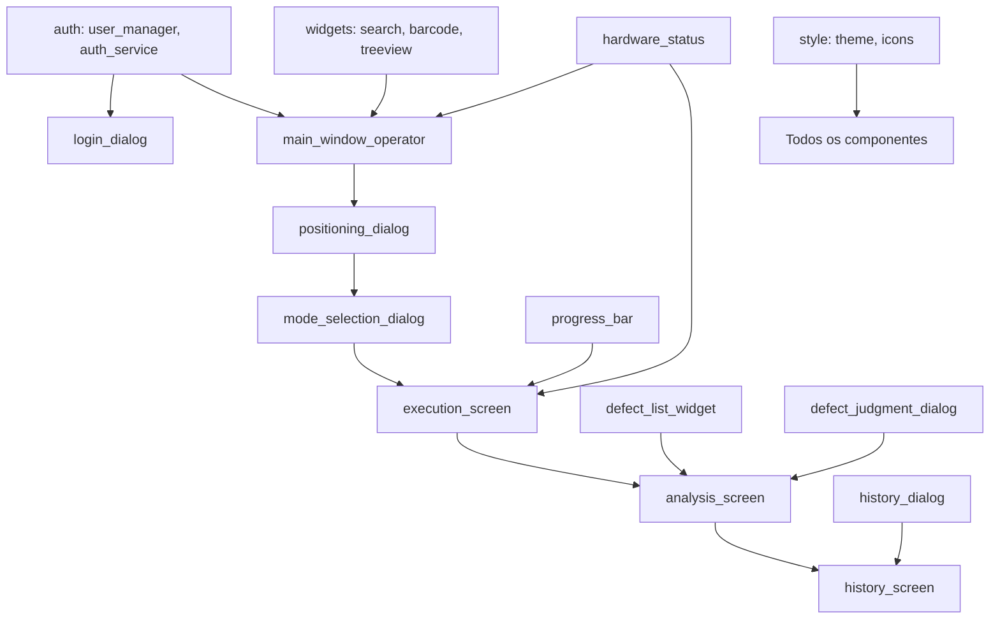

# Plano de Implementação - Interface do Operador

**Data:** 2026-01-08
**Versão:** 1.0
**Status:** 📋 Planejamento
**Baseado em:** `docs/guides/fluxo_usuario_operador.md`

---

## 📋 ÍNDICE

1. [Visão Geral](#visão-geral)
2. [Arquitetura da Solução](#arquitetura-da-solução)
3. [Fases de Implementação](#fases-de-implementação)
4. [Estrutura de Módulos](#estrutura-de-módulos)
5. [Dependências entre Componentes](#dependências-entre-componentes)
6. [Cronograma de Entregas](#cronograma-de-entregas)
7. [Riscos e Mitigações](#riscos-e-mitigações)
8. [Critérios de Aceite](#critérios-de-aceite)
9. [Plano de Testes](#plano-de-testes)
10. [Checklist de Validação](#checklist-de-validação)

---

## VISÃO GERAL

### Objetivo

Implementar a interface completa do usuário operador do sistema Tensiômetro, baseada nos wireframes validados pelo cliente e fluxo documentado em `fluxo_usuario_operador.md`.

### Escopo

**INCLUI:**
- Sistema de login com controle de acesso
- Tela inicial (TreeView) com busca e filtros
- Dialogs de confirmação e escolha de modo
- Tela de execução automática com feedback visual
- Tela de análise visual humana (julgamento de defeitos)
- Tela de histórico com exportação

**NÃO INCLUI:**
- Interface de engenharia (gerenciamento de programas)
- Configurações do sistema (próxima fase)
- Dashboard administrativo
- Relatórios personalizados

### Premissas

1. **Wireframes Aprovados:** Cliente validou todos os wireframes SVG
2. **Hardware Funcional:** PLC, Tensiômetro e Câmera estão operacionais
3. **Backend Pronto:** `aoi_lib/` tem toda a lógica de negócio implementada
4. **PyQt6:** Framework de interface escolhido
5. **Python 3.10+:** Versão mínima do Python

---

## ARQUITETURA DA SOLUÇÃO

### Estrutura de Pacotes

```
consumo_lib/
├── gui/                          # NOVO: Interface do operador
│   ├── __init__.py
│   ├── login_dialog.py           # Dialog de login
│   ├── main_window_operator.py   # Janela principal do operador
│   ├── widgets/                  # Componentes reutilizáveis
│   │   ├── __init__.py
│   │   ├── search_widget.py      # Busca incremental
│   │   ├── barcode_reader.py     # Leitor de código de barras
│   │   ├── program_treeview.py   # TreeView de programas
│   │   ├── progress_bar.py       # Barra de progresso animada
│   │   ├── defect_list_widget.py # Lista de defeitos
│   │   └── hardware_status.py    # Indicadores de hardware
│   ├── dialogs/                  # Dialogs modais
│   │   ├── __init__.py
│   │   ├── positioning_dialog.py # Confirmação de posicionamento
│   │   ├── mode_selection_dialog.py # Escolha do modo
│   │   ├── defect_judgment_dialog.py # Julgamento de defeitos
│   │   └── history_dialog.py     # Histórico de medições
│   ├── screens/                  # Telas principais
│   │   ├── __init__.py
│   │   ├── execution_screen.py   # Tela de execução
│   │   ├── analysis_screen.py    # Tela de análise visual
│   │   └── history_screen.py     # Tela de histórico
│   └── controllers/              # Controladores de UI
│       ├── __init__.py
│       ├── login_controller.py   # Controle de autenticação
│       ├── execution_controller.py # Controle de execução
│       └── analysis_controller.py # Controle de análise
│
├── auth/                         # NOVO: Autenticação e autorização
│   ├── __init__.py
│   ├── user_manager.py           # Gerenciamento de usuários
│   ├── auth_service.py           # Serviço de autenticação
│   └── permissions.py            # Matriz de permissões
│
└── existing modules...           # Módulos existentes (manter)
```

### Fluxo de Dados

```
User Input (GUI)
    ↓
PyQt6 Widget/Dialog
    ↓
Controller (validação + lógica de apresentação)
    ↓
Service Layer (aoi_lib)
    ↓
Hardware Layer (PLC, Tensiômetro, Câmera)
    ↓
Data Layer (SQLite, JSON)
```

---

## FASES DE IMPLEMENTAÇÃO

### FASE 0: Preparação (Semana 0)

**Objetivo:** Configurar estrutura base e dependências

**Tarefas:**
1. Criar estrutura de diretórios `consumo_lib/gui/`
2. Configurar imports relativos
3. Criar classes base (`BaseDialog`, `BaseScreen`, `BaseWidget`)
4. Configurar sistema de logging para GUI
5. Criar testes de integração base

**Entregáveis:**
- Estrutura de pacotes criada
- Classes base implementadas
- Testes passando

**Critérios de Sucesso:**
- [ ] Estrutura criada seguindo padrões do projeto
- [ ] Imports funcionando corretamente
- [ ] Logging configurado para todos os módulos GUI
- [ ] Testes base passando

---

### FASE 1: Autenticação (Semana 1)

**Objetivo:** Implementar sistema de login e controle de acesso

**Componentes:**
1. `consumo_lib/auth/user_manager.py`
2. `consumo_lib/auth/auth_service.py`
3. `consumo_lib/auth/permissions.py`
4. `consumo_lib/gui/login_dialog.py`

**Funcionalidades:**
- Login com usuário/senha
- Validação de perfil (Operador/Engenharia/Admin)
- Controle de sessão
- Logout
- Matriz de permissões

**Dados de Teste:**
```json
{
  "users": [
    {
      "username": "operador1",
      "password": "hashed_password",
      "profile": "operator",
      "name": "João Silva"
    },
    {
      "username": "engenheiro1",
      "password": "hashed_password",
      "profile": "engineering",
      "name": "Maria Santos"
    },
    {
      "username": "admin",
      "password": "hashed_password",
      "profile": "admin",
      "name": "Administrador"
    }
  ]
}
```

**Critérios de Sucesso:**
- [ ] Login funcional com 3 perfis
- [ ] Permissões corretas por perfil
- [ ] Sessão mantida durante uso
- [ ] Logout funcional
- [ ] Testes unitários passando
- [ ] Testes de integração passando

---

### FASE 2: Tela Inicial - TreeView (Semana 2-3)

**Objetivo:** Implementar tela inicial com lista de programas

**Componentes:**
1. `consumo_lib/gui/widgets/search_widget.py`
2. `consumo_lib/gui/widgets/barcode_reader.py`
3. `consumo_lib/gui/widgets/program_treeview.py`
4. `consumo_lib/gui/widgets/hardware_status.py`
5. `consumo_lib/gui/main_window_operator.py`

**Funcionalidades:**
- TreeView com programas cadastrados
- Busca incremental (debounce 300ms)
- Leitor de código de barras
- Filtros (período, status)
- Ordenação
- Painel de detalhes do stencil
- Indicadores de hardware (PLC, Tensiômetro, Câmera)
- Histórico visual (10 pontos)

**Wireframe Referência:** `02_tela_inicial_treeview.svg`

**Critérios de Sucesso:**
- [ ] TreeView populada com programas do banco
- [ ] Busca incremental funcionando
- [ ] Código de barras funcionando
- [ ] Filtros aplicando corretamente
- [ ] Ordenação funcionando
- [ ] Detalhes exibindo corretamente
- [ ] Hardware status atualizando em tempo real
- [ ] Histórico visual exibindo últimos 10
- [ ] Testes passando

---

### FASE 3: Dialogs de Confirmação (Semana 4)

**Objetivo:** Implementar dialogs de confirmação e escolha de modo

**Componentes:**
1. `consumo_lib/gui/dialogs/positioning_dialog.py`
2. `consumo_lib/gui/dialogs/mode_selection_dialog.py`

**Funcionalidades - Positioning Dialog:**
- Exibir código do stencil selecionado
- Instruções de verificação
- Checklist visual
- Botões: Confirmar / Cancelar
- Monitoramento de Emergency Stop

**Funcionalidades - Mode Selection Dialog:**
- 3 opções cards: Apenas Tensão, Apenas Inspeção, Ambos
- Descrições e tempos estimados
- Indicador de "Recomendado"
- Botão de seleção em cada card
- Botão Cancelar

**Wireframes Referência:**
- `03_confirmacao_posicionamento.svg`
- `04_escolha_modo.svg`

**Critérios de Sucesso:**
- [ ] Positioning dialog exibindo corretamente
- [ ] Emergency stop monitorado
- [ ] Mode selection com 3 cards
- [ ] Tempos estimados calculados corretamente
- [ ] Modo recomendado destacado
- [ ] Testes passando

---

### FASE 4: Tela de Execução (Semana 5-6)

**Objetivo:** Implementar tela de execução automática com feedback visual

**Componentes:**
1. `consumo_lib/gui/widgets/progress_bar.py`
2. `consumo_lib/gui/screens/execution_screen.py`
3. `consumo_lib/gui/controllers/execution_controller.py`

**Funcionalidades:**
- Barra de progresso animada
- Contador de pontos (ex: "12/25 pontos (48%)")
- Grid visual 5x5 com:
  - Pontos medidos (verde)
  - Ponto atual (laranja)
  - Pontos pendentes (cinza)
- Tempo estimado restante
- Valores em tempo real (animados)
- Estatísticas (mínima, máxima, média)
- Status de hardware
- Log de medição
- Botão Parar (com confirmação)

**Wireframe Referência:** `05_tela_execucao.svg`

**Critérios de Sucesso:**
- [ ] Barra de progresso atualizando
- [ ] Grid visual preenchendo corretamente
- [ ] Tempo estimado calculado e exibido
- [ ] Valores em tempo real animados
- [ ] Estatísticas atualizando
- [ ] Hardware status monitorado
- [ ] Log populando
- [ ] Botão Parar funcionando
- [ ] Tratamento de erros implementado
- [ ] Testes passando

---

### FASE 5: Análise Visual Humana (Semana 7-8)

**Objetivo:** Implementar tela de julgamento de defeitos

**Componentes:**
1. `consumo_lib/gui/widgets/defect_list_widget.py`
2. `consumo_lib/gui/screens/analysis_screen.py`
3. `consumo_lib/gui/dialogs/defect_judgment_dialog.py`
4. `consumo_lib/gui/controllers/analysis_controller.py`

**Funcionalidades:**
- Lista de defeitos com paginação
- Preview de imagem do defeito
- Controles de zoom
- Dropdown de tipos de defeitos (configurável)
- Campo de anotações
- Julgamento:
  - Confirmar como defeito
  - Aprovar (override do sistema)
- Navegação (Anterior/Próximo)
- Progresso de análise (ex: "3 de 15 analisados")
- Botão Finalizar

**Wireframe Referência:** `06_analise_visual_humana.svg`

**Dados de Configuração:**
```json
{
  "defect_types": [
    {"id": 1, "name": "Bloqueado por resíduo de pasta", "severity": "high"},
    {"id": 2, "name": "Abertura deformada", "severity": "medium"},
    {"id": 3, "name": "Dano mecânico", "severity": "high"},
    {"id": 4, "name": "Sujidade generalizada", "severity": "medium"}
  ]
}
```

**Critérios de Sucesso:**
- [ ] Lista de defeitos exibida
- [ ] Imagem do defeito mostrada
- [ ] Zoom funcionando
- [ ] Dropdown de defeitos populado
- [ ] Anotações funcionando
- [ ] Julgamento registrando corretamente
- [ ] Navegação funcionando
- [ ] Progresso atualizando
- [ ] Finalizar salvando tudo
- [ ] Testes passando

---

### FASE 6: Tela de Histórico (Semana 9)

**Objetivo:** Implementar tela de histórico com exportação

**Componentes:**
1. `consumo_lib/gui/screens/history_screen.py`
2. `consumo_lib/gui/dialogs/history_dialog.py`

**Funcionalidades:**
- Tabela de medições
- Filtros de período (7, 30, 60, 90, 180, 365 dias)
- Filtros de status (Todos, Aprovados, Reprovados)
- Estatísticas do período
- Ações:
  - Ver detalhes
  - Gerar PDF
  - Exportar CSV
- Paginação da tabela

**Wireframe Referência:** `07_tela_historico.svg`

**Critérios de Sucesso:**
- [ ] Tabela populada com medições
- [ ] Filtros funcionando
- [ ] Estatísticas calculadas corretamente
- [ ] Detalhes exibindo corretamente
- [ ] PDF gerando
- [ ] CSV exportando
- [ ] Paginação funcionando
- [ ] Testes passando

---

### FASE 7: Integração e Refinamento (Semana 10)

**Objetivo:** Integrar todos os componentes e polir interface

**Tarefas:**
1. Integrar todas as telas no fluxo principal
2. Implementar transições suaves
3. Adicionar animações e feedbacks visuais
4. Tratamento de erros consistente
5. Mensagens de erro amigáveis
6. Validações de entrada
7. Performance optimization
8. Code review e refatoração

**Critérios de Sucesso:**
- [ ] Fluxo completo funcional
- [ ] Transições suaves
- [ ] Erros tratados elegantemente
- [ ] Validações implementadas
- [ ] Performance aceitável (<100ms por ação)
- [ ] Código limpo e documentado
- [ ] Testes E2E passando

---

### FASE 8: Testes e Documentação (Semana 11-12)

**Objetivo:** Testar exaustivamente e documentar

**Tarefas:**
1. Testes unitários de todos os componentes
2. Testes de integração entre módulos
3. Testes E2E do fluxo completo
4. Testes com hardware real (se disponível)
5. Documentação de código (docstrings)
6. Manual do usuário operador
7. Guia de instalação
8. Checklist de validação final

**Critérios de Sucesso:**
- [ ] 80%+ coverage em testes unitários
- [ ] Testes de integração passando
- [ ] Testes E2E passando
- [ ] Código documentado
- [ ] Manuais criados
- [ ] Checklist final preenchido

---

## ESTRUTURA DE MÓDULOS

### Classes Base

#### BaseDialog
```python
class BaseDialog(QDialog):
    """Dialog base com funcionalidades comuns"""

    def __init__(self, parent=None):
        super().__init__(parent)
        self.setup_ui()
        self.connect_signals()

    def setup_ui(self):
        """Override para configurar UI"""
        raise NotImplementedError

    def connect_signals(self):
        """Override para conectar sinais"""
        raise NotImplementedError

    def show_error(self, message: str):
        """Exibe mensagem de erro padronizada"""

    def show_success(self, message: str):
        """Exibe mensagem de sucesso padronizada"""
```

#### BaseScreen
```python
class BaseScreen(QWidget):
    """Tela base com funcionalidades comuns"""

    def __init__(self, parent=None):
        super().__init__(parent)
        self.setup_ui()
        self.connect_signals()

    def setup_ui(self):
        """Override para configurar UI"""
        raise NotImplementedError

    def connect_signals(self):
        """Override para conectar sinais"""
        raise NotImplementedError

    def on_enter(self):
        """Chamado quando tela é exibida"""

    def on_exit(self):
        """Chamado quando tela é fechada"""
```

#### BaseWidget
```python
class BaseWidget(QWidget):
    """Widget base com funcionalidades comuns"""

    def __init__(self, parent=None):
        super().__init__(parent)
        self.setup_ui()

    def setup_ui(self):
        """Override para configurar UI"""
        raise NotImplementedError

    def update_data(self, data):
        """Override para atualizar dados exibidos"""
        raise NotImplementedError
```

---

## DEPENDÊNCIAS ENTRE COMPONENTES

### Grafo de Dependência



### Ordem de Implementação

**Fase 1 (Bloco 1):**
1. `auth/` (independente)
2. `login_dialog.py` (depende de `auth/`)

**Fase 2 (Bloco 2):**
3. `widgets/` (independentes entre si)
4. `main_window_operator.py` (depende de `widgets/`)

**Fase 3 (Bloco 3):**
5. `positioning_dialog.py` (depende de `main_window_operator.py`)
6. `mode_selection_dialog.py` (depende de `positioning_dialog.py`)

**Fase 4 (Bloco 4):**
7. `progress_bar.py` (independente)
8. `execution_screen.py` (depende de `progress_bar.py`)

**Fase 5 (Bloco 5):**
9. `defect_list_widget.py` (independente)
10. `analysis_screen.py` (depende de `defect_list_widget.py`)

**Fase 6 (Bloco 6):**
11. `history_screen.py` (independente, mas usa mesmos padrões)

---

## CRONOGRAMA DE ENTREGAS

### Gantt Chart

| Semana | 0 | 1 | 2 | 3 | 4 | 5 | 6 | 7 | 8 | 9 | 10 | 11 | 12 |
|--------|---|---|---|---|---|---|---|---|---|---|---|---|---|
| FASE 0: Preparação | ██ | | | | | | | | | | | | |
| FASE 1: Autenticação | | ██ | | | | | | | | | | | |
| FASE 2: TreeView | | | ██ | ██ | | | | | | | | | |
| FASE 3: Dialogs | | | | | ██ | | | | | | | | |
| FASE 4: Execução | | | | | | ██ | ██ | | | | | | |
| FASE 5: Análise | | | | | | | | ██ | ██ | | | | |
| FASE 6: Histórico | | | | | | | | | | ██ | | | |
| FASE 7: Integração | | | | | | | | | | | ██ | | |
| FASE 8: Testes | | | | | | | | | | | | ██ | ██ |

### Marcos (Milestones)

- **M1 (Semana 0):** Estrutura base criada
- **M2 (Semana 1):** Login funcional
- **M3 (Semana 3):** TreeView funcional
- **M4 (Semana 4):** Dialogs implementados
- **M5 (Semana 6):** Execução funcionando
- **M6 (Semana 8):** Análise implementada
- **M7 (Semana 9):** Histórico funcional
- **M8 (Semana 10):** Integração completa
- **M9 (Semana 12):** Sistema testado e documentado

---

## RISCOS E MITIGAÇÕES

### R1: Wireframes Não Aprovados pelo Cliente

**Probabilidade:** Alta
**Impacto:** Alto

**Mitigação:**
- Validar wireframes SVG com cliente ANTES de iniciar implementação
- Documentar feedback do cliente
- Criar versão modificada se necessário
- Assinar termo de aprovação

### R2: Hardware Não Disponível para Testes

**Probabilidade:** Média
**Impacto:** Médio

**Mitigação:**
- Criar mocks de hardware para testes unitários
- Implementar modo de simulação
- Agendar janela de testes com hardware real
- Priorizar testes sem hardware primeiro

### R3: Mudança de Requisitos Durante Implementação

**Probabilidade:** Média
**Impacto:** Alto

**Mitigação:**
- Documentar todos os requisitos detalhadamente
- Criar contrato de escopo
- Processo de change request formal
- Avaliar impacto de mudanças antes de aceitar

### R4: Performance Insuficiente

**Probabilidade:** Baixa
**Impacto:** Médio

**Mitigação:**
- Implementar otimizações desde o início
- Usar threading para operações longas
- Testar com datasets grandes
- Profile de código durante desenvolvimento

### R5: Dependências de Bibliotecas

**Probabilidade:** Baixa
**Impacto:** Baixo

**Mitigação:**
- Usar apenas bibliotecas estáveis e bem mantidas
- Documentar versões exatas
- Criar requirements.txt
- Testar compatibilidade

---

## CRITÉRIOS DE ACEITE

### Por Fase

#### FASE 0: Preparação
- [ ] Estrutura de diretórios criada
- [ ] Classes base implementadas
- [ ] Testes base configurados
- [ ] Logging funcional

#### FASE 1: Autenticação
- [ ] Login funcional
- [ ] 3 perfis implementados
- [ ] Permissões funcionando
- [ ] Logout funcionando
- [ ] Testes passando (80%+ coverage)

#### FASE 2: TreeView
- [ ] Lista de programas exibida
- [ ] Busca incremental funcionando
- [ ] Código de barras funcionando
- [ ] Filtros aplicando
- [ ] Detalhes exibindo
- [ ] Hardware status atualizando
- [ ] Testes passando

#### FASE 3: Dialogs
- [ ] Dialog de posicionamento exibindo
- [ ] Emergency stop monitorado
- [ ] Dialog de modo exibindo
- [ ] 3 modos funcionais
- [ ] Testes passando

#### FASE 4: Execução
- [ ] Tela de execução exibindo
- [ ] Progresso atualizando
- [ ] Grid visual preenchendo
- [ ] Valores em tempo real animados
- [ ] Botão parar funcionando
- [ ] Erros tratados
- [ ] Testes passando

#### FASE 5: Análise
- [ ] Lista de defeitos exibida
- [ ] Imagem mostrada
- [ ] Julgamento funcionando
- [ ] Navegação funcionando
- [ ] Salvamento funcionando
- [ ] Testes passando

#### FASE 6: Histórico
- [ ] Tabela exibindo
- [ ] Filtros funcionando
- [ ] Exportações funcionando
- [ ] Testes passando

#### FASE 7: Integração
- [ ] Fluxo completo funcional
- [ ] Sem bugs críticos
- [ ] Performance aceitável
- [ ] Transições suaves

#### FASE 8: Testes Finais
- [ ] 80%+ coverage
- [ ] Testes E2E passando
- [ ] Código documentado
- [ ] Manuais criados

---

## PLANO DE TESTES

### Pirâmide de Testes

```
        E2E (10%)
       /         \
      /           \
     /  Integração (30%)
    /               \
   /                 \
  /  Unitários (60%)
 /
```

### Testes Unitários (60%)

**Cobertura esperada:** 80%+

**Ferramenta:** pytest

**Exemplos:**
```python
def test_login_dialog_valid_credentials():
    """Testa login com credenciais válidas"""
    dialog = LoginDialog()
    dialog.username_input.setText("operador1")
    dialog.password_input.setText("password123")
    assert dialog.authenticate() == True
    assert dialog.user_profile == "operator"

def test_search_widget_incremental():
    """Testa busca incremental com debounce"""
    widget = SearchWidget()
    widget.text_input.setText("ABC")
    # Aguarda debounce de 300ms
    time.sleep(0.35)
    assert widget.search_called == True
```

### Testes de Integração (30%)

**Ferramenta:** pytest + fixtures

**Exemplos:**
```python
def test_treeview_to_execution_flow():
    """Testa fluxo completo da TreeView até execução"""
    main_window = MainWindowOperator()
    main_window.login("operador1", "password")

    # Seleciona programa
    main_window.select_program("STENCIL-ABC-123")

    # Confirma posicionamento
    main_window.confirm_positioning()

    # Escolhe modo
    main_window.select_mode("tensao")

    # Executa
    assert main_window.current_screen == ExecutionScreen
```

### Testes E2E (10%)

**Ferramenta:** pytest + QtBot

**Exemplos:**
```python
def test_complete_operator_flow(qtbot):
    """Testa fluxo completo do operador"""
    app = QApplication([])
    main_window = MainWindowOperator()
    main_window.show()

    # Login
    qtbot.key_clicks(main_window.login_dialog.username, "operador1")
    qtbot.key_clicks(main_window.login_dialog.password, "password123")
    qtbot.mouse_click(main_window.login_dialog.login_button, Qt.LeftButton)

    # Aguarda tela principal
    qtbot.wait_until(lambda: main_window.treeview.isVisible())

    # Seleciona programa
    qtbot.mouse_click(main_window.treeview.program_item, Qt.LeftButton)

    # Confirma posicionamento
    qtbot.mouse_click(main_window.positioning_dialog.confirm_button, Qt.LeftButton)

    # Escolhe modo
    qtbot.mouse_click(main_window.mode_dialog.tensao_button, Qt.LeftButton)

    # Executa
    qtbot.wait_until(lambda: main_window.execution_screen.isVisible())

    # Verifica execução
    assert main_window.execution_screen.progress_bar.value() == 100
```

---

## CHECKLIST DE VALIDAÇÃO

### Pré-Implementação

- [ ] Wireframes aprovados pelo cliente
- [ ] Fluxo documentado revisado
- [ ] Requisitos claros e documentados
- [ ] Cronograma aprovado
- [ ] Recursos alocados
- [ ] Ambiente de desenvolvimento configurado

### Durante Implementação

#### FASE 0
- [ ] Estrutura criada
- [ ] Classes base implementadas
- [ ] Testes configurados
- [ ] Code review realizado

#### FASE 1
- [ ] Login funcionando
- [ ] Perfis implementados
- [ ] Permissões funcionando
- [ ] Testes passando
- [ ] Code review realizado

#### FASE 2
- [ ] TreeView funcionando
- [ ] Busca incremental OK
- [ ] Código de barras OK
- [ ] Filtros OK
- [ ] Testes passando
- [ ] Code review realizado

#### FASE 3
- [ ] Dialogs implementados
- [ ] Emergency stop OK
- [ ] Modos funcionando
- [ ] Testes passando
- [ ] Code review realizado

#### FASE 4
- [ ] Execução funcionando
- [ ] Feedback visual OK
- [ ] Valores em tempo real OK
- [ ] Tratamento de erros OK
- [ ] Testes passando
- [ ] Code review realizado

#### FASE 5
- [ ] Análise implementada
- [ ] Julgamento OK
- [ ] Navegação OK
- [ ] Salvamento OK
- [ ] Testes passando
- [ ] Code review realizado

#### FASE 6
- [ ] Histórico funcionando
- [ ] Exportações OK
- [ ] Filtros OK
- [ ] Testes passando
- [ ] Code review realizado

#### FASE 7
- [ ] Integração completa
- [ ] Fluxo OK
- [ ] Sem bugs críticos
- [ ] Performance OK
- [ ] Code review realizado

#### FASE 8
- [ ] Testes E2E passando
- [ ] 80%+ coverage
- [ ] Código documentado
- [ ] Manuais criados
- [ ] Checklist final preenchido

### Pós-Implementação

- [ ] Validação com cliente
- [ ] Feedback documentado
- [ ] Ajustes finais implementados
- [ ] Deploy em produção
- [ ] Treinamento de usuários
- [ ] Suporte pós-deploy

---

## CONCLUSÃO

Este plano fornece uma estrutura clara e detalhada para implementação da interface do operador do sistema Tensiômetro. Seguindo as fases, cronograma e critérios estabelecidos, garantimos uma implementação coesa, testada e documentada.

**Próximos Passos:**
1. Validar wireframes SVG com cliente
2. Ajustar wireframes se necessário
3. Iniciar FASE 0 (Preparação)
4. Seguir cronograma rigorosamente

**Contingência:**
Se qualquer fase atrasar, avaliar:
- Impacto no cronograma total
- Possibilidade de paralelizar tarefas
- Necessidade de ajustar escopo

**Sucesso:**
Implementação completa em 12 semanas, com interface funcional, testada e aprovada pelo cliente.

---

**Documento criado em:** 2026-01-08
**Versão:** 1.0
**Próxima revisão:** Após validação de wireframes com cliente
